# 💳 Personal Finance ETL & Dashboard Project

An **end-to-end Data Engineering & Analytics pipeline** for tracking and analyzing personal finance.

This project demonstrates how to:
- 🔗 **Fetch** data from a Mock API (simulating bank transactions)
- ⚙️ **ETL** the data into **PostgreSQL** using **Apache Airflow**
- 📊 **Visualize & Analyze** the data with **Power BI**

---

## 🚀 Tech Stack

- **Data Source** → Mock API (REST)
- **Orchestration** → Apache Airflow
- **Database** → PostgreSQL (running inside WSL2)
- **Visualization** → Power BI
- **Programming** → Python (`requests`, `pandas`, `pyspark`)

---

## 📂 Project Structure

```bash
personal_finance_project/
│
├── airflow/
│   ├── dags/
│   │   └── etl_pipeline.py      # Main Airflow DAG
│   ├── scripts/
│   │   ├── extract.py           # Fetch data from Mock API
│   │   ├── transform.py         # Clean and enrich data
│   │   └── load.py              # Load into PostgreSQL
│
├── data/
│   ├── raw/                     # Stores raw API responses
│   └── staging/                 # Stores processed data
│
├── powerbi/
│   └── finance_dashboard.pbix   # Power BI dashboard file
│
└── README.md
```

---

## 🔄 ETL Flow

```mermaid
flowchart LR
    A[📥 Extract<br/>Mock API] --> B[🧹 Transform<br/>Clean & Enrich Data]
    B --> C[🗄️ Load<br/>PostgreSQL Database]
    C --> D[📊 Visualize<br/>Power BI Dashboards]
```



### Pipeline Stages

**🔹 Extract →** Fetch JSON data from the Mock API  
**🔹 Transform →** Clean data & add derived fields (`year`, `month`, `transaction_type`)  
**🔹 Load →** Insert the processed data into PostgreSQL schema  
**🔹 Visualize →** Build interactive Power BI dashboards for financial insights

---

## 🗄️ Database Schema

### 1️⃣ accounts table

```sql
CREATE TABLE accounts (
    account_id SERIAL PRIMARY KEY,
    name VARCHAR(100) NOT NULL,
    currency VARCHAR(10) DEFAULT 'INR',
    created_at TIMESTAMP DEFAULT CURRENT_TIMESTAMP
);
```

### 2️⃣ merchants table

```sql
CREATE TABLE merchants (
    merchant_id SERIAL PRIMARY KEY,
    merchant_name VARCHAR(255) NOT NULL,
    category VARCHAR(100)
);
```

### 3️⃣ transactions table

```sql
CREATE TABLE transactions (
    transaction_id SERIAL PRIMARY KEY,
    account_id INT REFERENCES accounts(account_id),
    merchant_id INT REFERENCES merchants(merchant_id),
    amount NUMERIC(12,2) NOT NULL,
    currency VARCHAR(10) DEFAULT 'INR',
    type VARCHAR(50),             -- deposit / withdrawal / payment / invoice
    transaction_type VARCHAR(50), -- Income / Expense
    category VARCHAR(100),
    description TEXT,
    date DATE NOT NULL,
    created_at TIMESTAMP DEFAULT CURRENT_TIMESTAMP,
    year INT,
    month INT
);
```

### 4️⃣ users table (Optional)

```sql
CREATE TABLE users (
    user_id SERIAL PRIMARY KEY,
    full_name VARCHAR(255),
    email VARCHAR(255) UNIQUE,
    created_at TIMESTAMP DEFAULT CURRENT_TIMESTAMP
);
```

**🔗 Relation:** `accounts.user_id` → `users.user_id`

---

## 📊 Power BI Dashboard Strategy

### 📌 Page 1 – Overview

- **Cards:** Total Income, Total Expenses, Net Balance
- **Line Chart:** Income vs Expense trend
- **Pie Chart:** Category-wise expense breakdown

### 📌 Page 2 – Trends & Comparison

- **Column Chart:** Monthly Income vs Expenses
- **Stacked Chart:** Category spend over months
- **Slicers:** Year, Month, Transaction Type, Merchant

### Dashboard Screenshots


---

## 🛠️ Setup & Installation

### Prerequisites

- Python 3.8+
- PostgreSQL
- Apache Airflow
- Power BI Desktop
- WSL2 (if running on Windows)

### Installation Steps

1. **Clone the repository**
   ```bash
   git clone <repository-url>
   cd personal_finance_project
   ```

2. **Set up Python environment**
   ```bash
   python -m venv venv
   source venv/bin/activate  # On Windows: venv\Scripts\activate
   pip install -r requirements.txt
   ```

3. **Configure PostgreSQL**
   ```bash
   # Create database
   createdb personal_finance
   
   # Run schema scripts
   psql -d personal_finance -f schema.sql
   ```

4. **Set up Airflow**
   ```bash
   export AIRFLOW_HOME=~/airflow
   airflow db init
   airflow users create --username admin --password admin --firstname Admin --lastname User --role Admin --email admin@example.com
   ```

5. **Start Airflow services**
   ```bash
   airflow webserver -p 8080
   airflow scheduler
   ```

---

## 🎯 Features

- ✅ Automated data extraction from Mock API
- ✅ Data transformation with derived metrics
- ✅ Normalized database schema with referential integrity
- ✅ Scheduled ETL pipeline using Airflow
- ✅ Interactive Power BI dashboards
- ✅ Real-time financial insights and trends

---

## 📈 Future Enhancements

- 🔮 Add predictive analytics for expense forecasting
- 🌐 Integrate with real banking APIs
- 📱 Create mobile-friendly dashboards
- 🔔 Implement budget alerts and notifications
- 🤖 Add machine learning for anomaly detection

---

## 📝 License

This project is licensed under the MIT License.

---

## 👤 Author

**Your Name**  
📧 Email: your.email@example.com  
🔗 LinkedIn: [Your Profile](https://linkedin.com/in/yourprofile)  
💻 GitHub: [Your GitHub](https://github.com/yourusername)

---

## 🤝 Contributing

Contributions, issues, and feature requests are welcome!  
Feel free to check the [issues page](link-to-issues).

---

⭐ **If you found this project helpful, please give it a star!** ⭐
